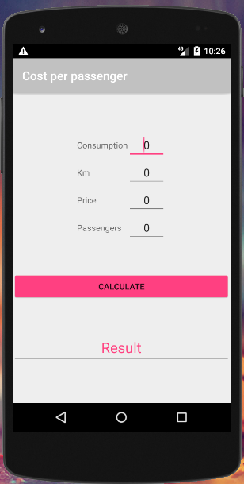

# GastoPorViajero


Calcula el gasto por viajero en un coche compartido a partir de los siguientes datos:

- Consumo del coche (L/100 km)
- Km recorridos
- Precio del litro de gasolina
- Número de pasajeros

Para ello utiliza la fórmula:

```
GastoViajero = ((consumo/100)*km*precio) / viajeros 
```


